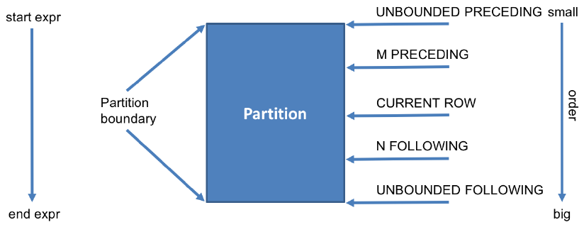

## 1.基本语法

```sql
Function (arg1,..., argn) OVER ([PARTITION BY <...>] [ORDER BY <....>]
[<window_expression>])
```

Function (arg1,..., argn) 可以是下面的函数：

- Aggregate Functions: 聚合函数,比如：sum(...)、 max(...)、min(...)、avg(...)等.
- Sort Functions: 数据排序函数, 比如 ：rank(...)、row_number(...)等.
- Analytics Functions: 统计和比较函数, 比如：lead(...)、lag(...)、 first_value(...)等.

## 2.数据准备

### 样例数据

```sql
[职工姓名|部门编号|职工ID|工资|岗位类型|入职时间]

Michael|1000|100|5000|full|2014-01-29
Will|1000|101|4000|full|2013-10-02
Wendy|1000|101|4000|part|2014-10-02
Steven|1000|102|6400|part|2012-11-03
Lucy|1000|103|5500|full|2010-01-03
Lily|1001|104|5000|part|2014-11-29
Jess|1001|105|6000|part|2014-12-02
Mike|1001|106|6400|part|2013-11-03
Wei|1002|107|7000|part|2010-04-03
Yun|1002|108|5500|full|2014-01-29
Richard|1002|109|8000|full|2013-09-01
```

### 建表语句

```sql
CREATE TABLE IF NOT EXISTS employee (
                name string,
                dept_num int,
                employee_id int,
                salary int,
                type string,
                start_date date
)
ROW FORMAT DELIMITED
FIELDS TERMINATED BY '|'
STORED as TEXTFILE;
```

### 加载数据

```
load data local inpath '/opt/datas/data/employee_contract.txt' into table employee;
```

## 窗口聚合函数

- 1.查询姓名、部门编号、工资以及部门人数

```sql
select 
    name,
    dept_num as deptno ,
    salary,
    count(*) over (partition by dept_num) as cnt 
from employee ;
```

**结果输出**

```
name    deptno  salary  cnt
Lucy    1000    5500    5
Steven  1000    6400    5
Wendy   1000    4000    5
Will    1000    4000    5
Michael 1000    5000    5
Mike    1001    6400    3
Jess    1001    6000    3
Lily    1001    5000    3
Richard 1002    8000    3
Yun     1002    5500    3
Wei     1002    7000    3
```

- 2.查询姓名、部门编号、工资以及每个部门的总工资，部门总工资按照降序输出

```sql
select 
    name ,
    dept_num as deptno,
    salary,
    sum(salary) over (partition by dept_num order by dept_num) as sum_dept_salary 
from employee 
order by sum_dept_salary desc;
```

**结果输出**

```
name    deptno  salary  sum_dept_salary
Michael 1000    5000    24900
Will    1000    4000    24900
Wendy   1000    4000    24900
Steven  1000    6400    24900
Lucy    1000    5500    24900
Wei     1002    7000    20500
Yun     1002    5500    20500
Richard 1002    8000    20500
Lily    1001    5000    17400
Jess    1001    6000    17400
Mike    1001    6400    17400
```

## 窗口排序函数

### 简介

窗口排序函数提供了数据的排序信息，比如行号和排名。在一个分组的内部将行号或者排名作为数据的一部分进行返回，最常用的排序函数主要包括：

- **row_number**

根据具体的分组和排序，为每行数据生成一个起始值等于1的唯一序列数

- **rank**

对组中的数据进行排名，如果名次相同，则排名也相同，但是下一个名次的排名序号会出现不连续。比如查找具体条件的topN行

- **dense_rank**

dense_rank函数的功能与rank函数类似，dense_rank函数在生成序号时是连续的，而rank函数生成的序号有可能不连续。当出现名次相同时，则排名序号也相同。而下一个排名的序号与上一个排名序号是连续的。

- **percent_rank**

排名计算公式为：(current rank - 1)/(total number of rows - 1)

- **ntile**

将一个有序的数据集划分为多个桶(bucket)，并为每行分配一个适当的桶数。它可用于将数据划分为相等的小切片，为每一行分配该小切片的数字序号。

### 使用案例

- 1.查询姓名、部门编号、工资、排名编号(按工资的多少排名)

```sql
select 
   name ,
   dept_num as dept_no ,
   salary,
   row_number() over (order by salary desc ) rnum 
from employee;
```

**结果输出**

```
name    dept_no salary  rnum
Richard 1002    8000    1
Wei     1002    7000    2
Mike    1001    6400    3
Steven  1000    6400    4
Jess    1001    6000    5
Yun     1002    5500    6
Lucy    1000    5500    7
Lily    1001    5000    8
Michael 1000    5000    9
Wendy   1000    4000    10
Will    1000    4000    11
```

- 2.查询每个部门工资最高的两个人的信息(姓名、部门、薪水)

```sql
select 
   name,
   dept_num,
   salary 
from
(
 select name ,
   dept_num ,
   salary,
   row_number() over (partition by dept_num order by salary desc ) rnum 
 from employee) t1
 where rnum <= 2;
```

**结果输出**

```
name    dept_num        salary
Steven  1000    6400
Lucy    1000    5500
Mike    1001    6400
Jess    1001    6000
Richard 1002    8000
Wei     1002    7000
```

- 3.查询每个部门的员工工资排名信息

```sql
select
 name ,
 dept_num as dept_no ,
 salary,row_number() over (partition by dept_num order by salary desc ) rnum 
from employee;
```

**结果输出**

```
name    dept_no salary  rnum
Steven  1000    6400    1
Lucy    1000    5500    2
Michael 1000    5000    3
Wendy   1000    4000    4
Will    1000    4000    5
Mike    1001    6400    1
Jess    1001    6000    2
Lily    1001    5000    3
Richard 1002    8000    1
Wei     1002    7000    2
Yun     1002    5500    3
```

- 4.使用rank函数进行排名

```sql
select
  name,
  dept_num,
  salary,
  rank() over (order by salary desc) rank
from employee;
```

**结果输出**

```
name    dept_num        salary  rank
Richard 1002    8000    1
Wei     1002    7000    2
Mike    1001    6400    3
Steven  1000    6400    3
Jess    1001    6000    5
Yun     1002    5500    6
Lucy    1000    5500    6
Lily    1001    5000    8
Michael 1000    5000    8
Wendy   1000    4000    10
Will    1000    4000    10
```

- 5.使用dense_rank进行排名

```sql
select
  name,
  dept_num,
  salary,
  dense_rank() over (order by salary desc) rank
from employee;
```

**结果输出**

```
name    dept_num        salary  rank
Richard 1002    8000    1
Wei     1002    7000    2
Mike    1001    6400    3
Steven  1000    6400    3
Jess    1001    6000    4
Yun     1002    5500    5
Lucy    1000    5500    5
Lily    1001    5000    6
Michael 1000    5000    6
Wendy   1000    4000    7
Will    1000    4000    7
```

- 6.使用percent_rank()进行排名

```sql
select
  name,
  dept_num,
  salary,
  percent_rank() over (order by salary desc) rank
from employee;
```

**结果输出**

```
name    dept_num        salary  rank
Richard 1002    8000    0.0
Wei     1002    7000    0.1
Mike    1001    6400    0.2
Steven  1000    6400    0.2
Jess    1001    6000    0.4
Yun     1002    5500    0.5
Lucy    1000    5500    0.5
Lily    1001    5000    0.7
Michael 1000    5000    0.7
Wendy   1000    4000    0.9
Will    1000    4000    0.9
```

- 7.使用ntile进行数据分片排名

```sql
SELECT
name,
dept_num as deptno,
salary,
ntile(4) OVER(ORDER BY salary desc) as ntile
FROM employee;
```

**结果输出**

```
name    deptno  salary  ntile
Richard 1002    8000    1
Wei     1002    7000    1
Mike    1001    6400    1
Steven  1000    6400    2
Jess    1001    6000    2
Yun     1002    5500    2
Lucy    1000    5500    3
Lily    1001    5000    3
Michael 1000    5000    3
Wendy   1000    4000    4
Will    1000    4000    4
```

**尖叫提示**：从 Hive v2.1.0开始, 支持在OVER语句里使用聚集函数，比如：

```sql
SELECT
  dept_num,
  row_number() OVER (PARTITION BY dept_num ORDER BY sum(salary)) as rk
FROM employee
GROUP BY dept_num;
```

**结果输出**

```
dept_num        rk
1000    1
1001    1
1002    1
```

## 窗口分析函数

### 介绍

常用的分析函数主要包括：

- **cume_dist**

如果按升序排列，则统计：小于等于当前值的行数/总行数(number of rows ≤ current row)/(total number of rows）。如果是降序排列，则统计：大于等于当前值的行数/总行数。比如，统计小于等于当前工资的人数占总人数的比例 ，用于累计统计.

- **lead(value_expr[,offset[,default]])**

用于统计窗口内往下第n行值。第一个参数为列名，第二个参数为往下第n行（可选，默认为1），第三个参数为默认值（当往下第n行为NULL时候，取默认值，如不指定，则为NULL.

- **lag(value_expr[,offset[,default]])**

与lead相反，用于统计窗口内往上第n行值。第一个参数为列名，第二个参数为往上第n行（可选，默认为1），第三个参数为默认值（当往上第n行为NULL时候，取默认值，如不指定，则为NULL.

- **first_value**

取分组内排序后，截止到当前行，第一个值

- **last_value**

取分组内排序后，截止到当前行，最后一个值

### 使用案例

- 1.统计小于等于当前工资的人数占总人数的比例

```sql
SELECT
 name,
 dept_num as deptno,
 salary,
 cume_dist() OVER (ORDER BY salary) as cume
FROM employee;
```

**结果输出**

```
name    deptno  salary  cume
Wendy   1000    4000    0.18181818181818182
Will    1000    4000    0.18181818181818182
Lily    1001    5000    0.36363636363636365
Michael 1000    5000    0.36363636363636365
Yun     1002    5500    0.5454545454545454
Lucy    1000    5500    0.5454545454545454
Jess    1001    6000    0.6363636363636364
Mike    1001    6400    0.8181818181818182
Steven  1000    6400    0.8181818181818182
Wei     1002    7000    0.9090909090909091
Richard 1002    8000    1.0
```

- 2.统计大于等于当前工资的人数占总人数的比例

```sql
SELECT
 name,
 dept_num as deptno,
 salary,
 cume_dist() OVER (ORDER BY salary desc) as cume
FROM employee;
```

**结果输出**

```
name    deptno  salary  cume
Richard 1002    8000    0.09090909090909091
Wei     1002    7000    0.18181818181818182
Mike    1001    6400    0.36363636363636365
Steven  1000    6400    0.36363636363636365
Jess    1001    6000    0.45454545454545453
Yun     1002    5500    0.6363636363636364
Lucy    1000    5500    0.6363636363636364
Lily    1001    5000    0.8181818181818182
Michael 1000    5000    0.8181818181818182
Wendy   1000    4000    1.0
Will    1000    4000    1.0
```

- 3.按照部门统计小于等于当前工资的人数占部门总人数的比例

```sql
SELECT
 name,
 dept_num as deptno,
 salary,
 cume_dist() OVER (PARTITION BY dept_num ORDER BY salary) as cume
FROM employee;
```

**结果输出**

```
name    deptno  salary  cume
Wendy   1000    4000    0.4
Will    1000    4000    0.4
Michael 1000    5000    0.6
Lucy    1000    5500    0.8
Steven  1000    6400    1.0
Lily    1001    5000    0.3333333333333333
Jess    1001    6000    0.6666666666666666
Mike    1001    6400    1.0
Yun     1002    5500    0.3333333333333333
Wei     1002    7000    0.6666666666666666
Richard 1002    8000    1.0
```

- 4.按部门分组，统计每个部门员工的工资以及大于等于该员工工资的下一个员工的工资

```sql
SELECT
 name,
 dept_num as deptno,
 salary,
 lead(salary,1) OVER (PARTITION BY dept_num ORDER BY salary) as lead
FROM employee;
```

**结果输出**

```
name    deptno  salary  lead
Wendy   1000    4000    4000
Will    1000    4000    5000
Michael 1000    5000    5500
Lucy    1000    5500    6400
Steven  1000    6400    NULL
Lily    1001    5000    6000
Jess    1001    6000    6400
Mike    1001    6400    NULL
Yun     1002    5500    7000
Wei     1002    7000    8000
Richard 1002    8000    NULL
```

- 5.按部门分组，统计每个部门员工的工资以及小于等于该员工工资的上一个员工的工资

```sql
SELECT
 name,
 dept_num as deptno,
 salary,
 lag(salary,1) OVER (PARTITION BY dept_num ORDER BY salary) as lead
FROM employee;
```

**结果输出**

```
name    deptno  salary  lead
Wendy   1000    4000    NULL
Will    1000    4000    4000
Michael 1000    5000    4000
Lucy    1000    5500    5000
Steven  1000    6400    5500
Lily    1001    5000    NULL
Jess    1001    6000    5000
Mike    1001    6400    6000
Yun     1002    5500    NULL
Wei     1002    7000    5500
Richard 1002    8000    7000
```

- 6.按部门分组，统计每个部门员工工资以及该部门最低的员工工资

```sql
SELECT
 name,
 dept_num as deptno,
 salary,
 first_value(salary) OVER (PARTITION BY dept_num ORDER BY salary) as fval
FROM employee;
```

**结果输出**

```
name    deptno  salary  fval
Wendy   1000    4000    4000
Will    1000    4000    4000
Michael 1000    5000    4000
Lucy    1000    5500    4000
Steven  1000    6400    4000
Lily    1001    5000    5000
Jess    1001    6000    5000
Mike    1001    6400    5000
Yun     1002    5500    5500
Wei     1002    7000    5500
Richard 1002    8000    5500
```

- 7.按部门分组，统计每个部门员工工资以及该部门最高的员工工资

```sql
SELECT
 name,
 dept_num as deptno,
 salary,
 last_value(salary) OVER (PARTITION BY dept_num ORDER BY salary RANGE
BETWEEN UNBOUNDED PRECEDING AND UNBOUNDED FOLLOWING) as lval
FROM employee;
```

**结果输出**

```
name    deptno  salary  lval
Wendy   1000    4000    6400
Will    1000    4000    6400
Michael 1000    5000    6400
Lucy    1000    5500    6400
Steven  1000    6400    6400
Lily    1001    5000    6400
Jess    1001    6000    6400
Mike    1001    6400    6400
Yun     1002    5500    8000
Wei     1002    7000    8000
Richard 1002    8000    8000
```

**注意**: last_value默认的窗口是RANGE BETWEEN UNBOUNDED PRECEDING AND CURRENT ROW，表示当前行永远是最后一个值，需改成RANGE BETWEEN UNBOUNDED PRECEDING AND UNBOUNDED FOLLOWING。





- RANGE BETWEEN UNBOUNDED PRECEDING AND CURRENT ROW

为默认值，即当指定了ORDER BY从句，而省略了window从句 ，表示从开始到当前行。

- RANGE BETWEEN CURRENT ROW AND UNBOUNDED FOLLOWING

表示从当前行到最后一行

- RANGE BETWEEN UNBOUNDED PRECEDING AND UNBOUNDED FOLLOWING

表示所有行

- n PRECEDING  m FOLLOWING

表示窗口的范围是：[（当前行的行数）- n, （当前行的行数）+m] row.